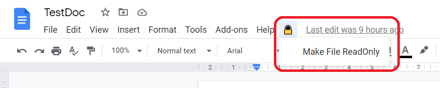

# LockIt

 

 

## Description

This is a simple google script to make google drive files (Docs, Sheets and Slides) read only to prevent accidental editing.

 

## Credits and References

- [How to Make your Documents Read-only in Google Drive - Digital Inspiration (labnol.org)](https://www.labnol.org/code/read-only-google-drive-file-201011)
- [Extending Google Docs  | Apps Script  | Google Developers](https://developers.google.com/apps-script/guides/docs)